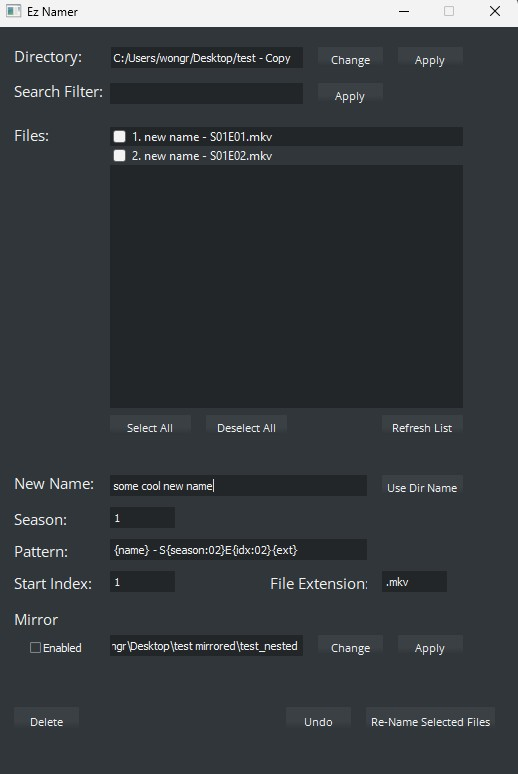

# Ez-Namer

Written by Russell Wong.

## What is Ez-Namer?

Ez-Namer is a user-friendly bulk file renaming app for organizing large batches
of photos and videos. It provides a PyQt GUI for filtering files, selecting a
rename batch, applying a naming pattern, and optionally keeping a mirror folder
in sync.



## Quick Start

Create a virtual environment, install the runtime dependencies, then run the
main app:

```powershell
python -m venv .venv
.\.venv\Scripts\Activate.ps1
python -m pip install -r requirements.txt
python app/eznamer.py
```

Then:

1. Click **Change** beside **Directory** to select the folder containing files to rename.
2. Optionally enter a search filter and click **Apply** beside **Search Filter**.
3. Select the files to rename in the list.
4. Enter the base name, season, starting episode index, file extension, and pattern.
5. Click **Re-Name Selected Files**.
6. Use **Undo** if you need to revert the most recent rename batch.

The default rename pattern is:

```text
{name} - S{season:02}E{idx:02}{ext}
```

Example output:

```text
Show Name - S01E01.mkv
Show Name - S01E02.mkv
```

## Mirror Mode

Mirror mode lets you rename matching files in a second folder at the same time.

1. Select the main directory.
2. Select the mirror directory.
3. Enable the mirror checkbox.
4. Ez-Namer checks whether both folders contain the same file names.
5. If the folders match, rename actions apply to both folders.

## Current Files

| File | Purpose |
| --- | --- |
| `app/eznamer.py` | Current main GUI app. |
| `app/eznamer_legacy.py` | Original command-line version. |
| `app/gui_list.py` | Generated PyQt UI code. |
| `app/gui_list.ui` | Qt Designer source file. |
| `resources/` | Icons, screenshots, Qt styles, and resource sources. |
| `tests/test_eznamer.py` | Tests for the refactored helper behavior. |
| `setup.py` | cx_Freeze build configuration. |
| `rebuild_ui.bat` | Regenerates `app/gui_list.py` from `app/gui_list.ui`. |

## Dependencies

Ez-Namer requires Python 3. Runtime dependencies are installed from
`requirements.txt`:

```powershell
python -m pip install -r requirements.txt
```

For development and packaging tools, install `requirements.dev` instead:

```powershell
python -m pip install -r requirements.dev
```

`requirements.dev` includes `pytest` for running the test suite and
`pytest-cov` for coverage reports.

The main runtime packages are:

| Module | Purpose |
| --- | --- |
| `PyQt5` | GUI framework. |
| `send2trash` | Safely sends deleted files to the recycle bin. |

## Development Notes

If the UI is edited in Qt Designer, regenerate `app/gui_list.py` from
`app/gui_list.ui` before testing the app.

Run the test suite with:

```powershell
python -m pytest -q
```

Run tests with coverage with:

```powershell
python -m pytest --cov=app --cov-report=term-missing -q
```

Build the Windows executable with:

```powershell
python setup.py build
```

The build config copies `resources/` so runtime assets such as the app icon are
available in the frozen app.

Runtime dependencies are declared in `requirements.in` and locked in
`requirements.txt`. After changing `requirements.in`, refresh the lock file
with:

```powershell
pip-compile --output-file requirements.txt --upgrade requirements.in
```

If `pip-compile` is not on your PATH, use:

```powershell
python -m piptools compile --output-file requirements.txt --upgrade requirements.in
```

## Legacy Command-Line Version

The legacy version is available as `app/eznamer_legacy.py`. It uses terminal-style
commands such as `ls`, `cd`, `add`, `adde`, `stage`, `rf`, `del`, and `clear`.

To run it:

```powershell
python app/eznamer_legacy.py
```
